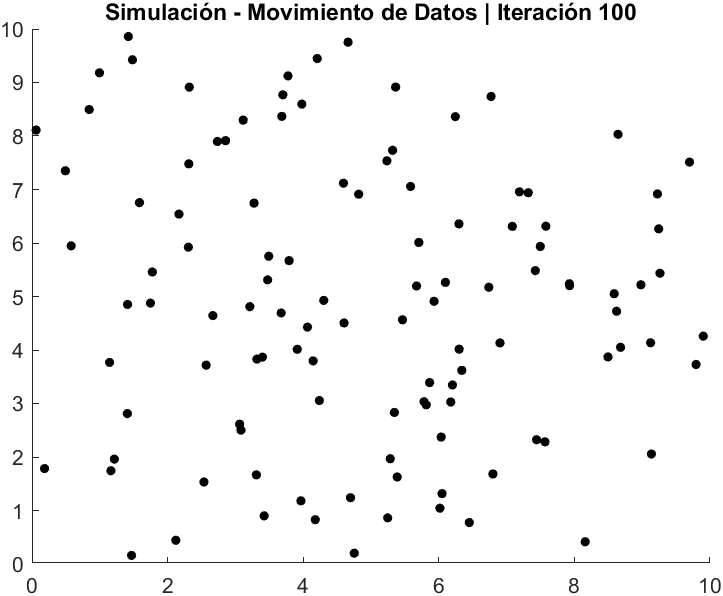
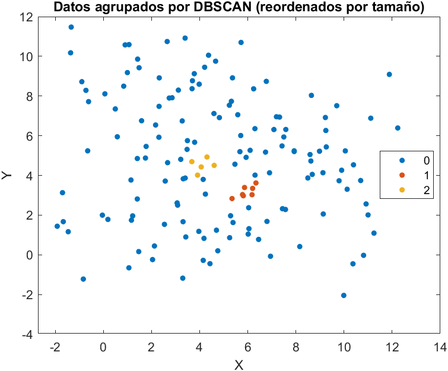
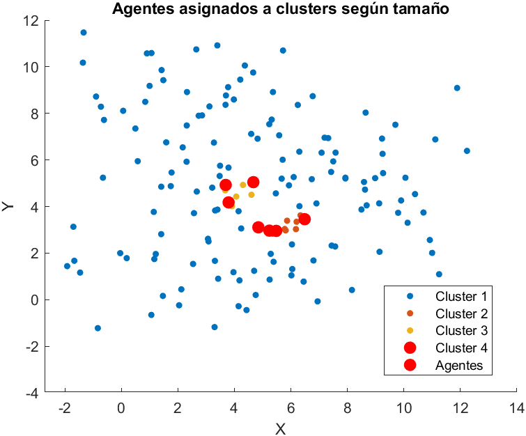
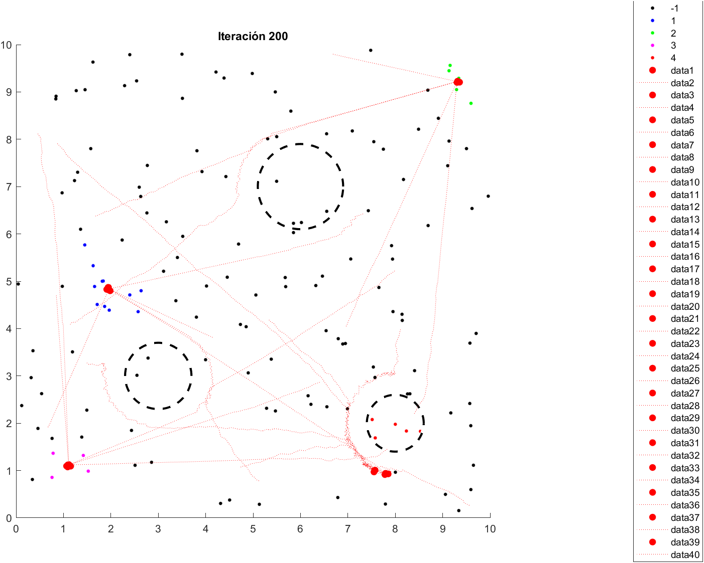
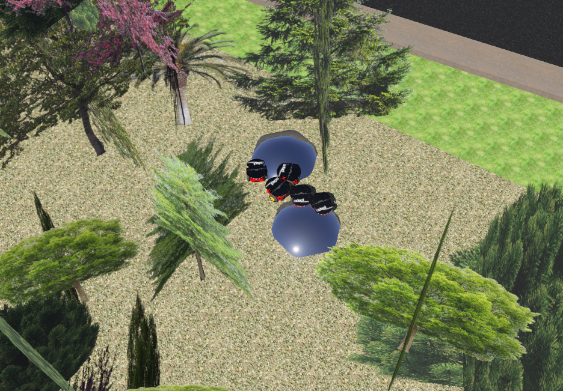
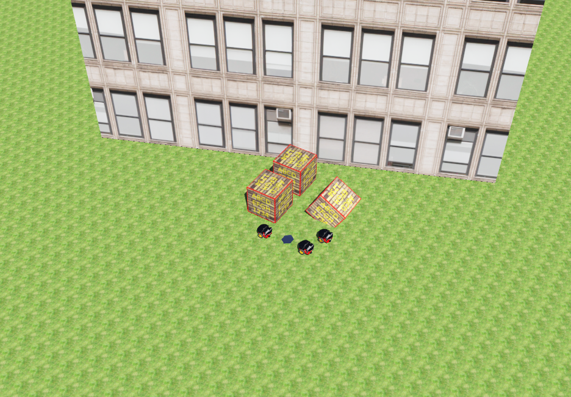
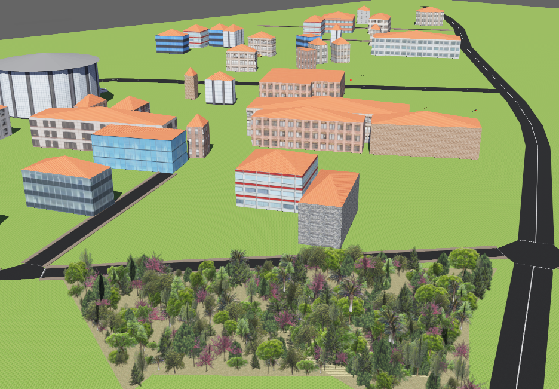

# Desarrollo de un método para una asignación eficiente de recursos implementando algoritmos de robótica de enjambre y de agrupamiento

## Autor

**Ronal Berganza**    
**Carné: 21214**

### Información de contacto

Correo institucional: [ber21214@uvg.edu.gt]  
Correo alternativo: [ronalberganza0510@gmail.com]

## Asesor

**Dr. Luis Alberto Rivera Estrada**

### Información de contacto

Correo institucional: [larivera@uvg.edu.gt](mailto:larivera@uvg.edu.gt)
---

## Resumen de contenido

| Carpeta   | Contenido |
|------------|-----------|
| **Matlab** | Contiene los scripts principales del algoritmo de agrupamiento DBSCAN y del método de optimización PSO para simulaciones simples en entornos 2D. |
| **Webots** | Contiene los controladores del robot y el entorno de simulación realista en entornos 3D. |

---

## Descripción

El objetivo principal de este proyecto de tesis es **desarrollar un método de asignación eficiente de recursos** basado en algoritmos de **robótica de enjambre** y **agrupamiento espacial (DBSCAN)**, aplicado a escenarios simulados de desastre.  

El sistema combina la capacidad del algoritmo **DBSCAN** para identificar grupos o zonas de interés con el algoritmo **PSO**, que optimiza la asignación y trayectoria de agentes robóticos según la densidad y tamaño de cada grupo.  

El enfoque fue validado mediante simulaciones en **MATLAB** y **Webots**, evaluando métricas como el **error cuadrático medio**, **tiempo de convergencia** y **eficiencia de trayectoria**, confirmando una mejora en comparación con métodos tradicionales.

---

## Funcionamiento general (MATLAB)

### Etapas del sistema

- Establecer parámetros e inicialización de datos/elementos a considerar en la asignación.  
- Agrupamiento de datos mediante **DBSCAN**.  
- Generación de obstáculos.  
- Asignación de agentes a cada grupo con trayectorias optimizadas utilizando **PSO**.  

### :wrench: Configuración de escenarios

- Número de agentes: `10 (ampliable)`  
- Número de datos/elementos aleatorios: `variable`  
- Número de obstáculos: `3`  
- Entorno: `simulador (MATLAB)`  

---

## :rocket: Ejecución de las simulaciones

### En MATLAB

1. Abrir la carpeta `/Matlab` en **MATLAB R2023a o superior**.  
2. Ejecutar los archivos `clustering_con_agentes.m` y `PSO_DBSCAN_Mejorado.m` para observar el desarrollo del código.  
3. Ejecutar `PSO_DBSCAN_Suavizado.m` para la simulación final con movimiento de agentes.

### En Webots

1. Abrir la carpeta `/Webots` y cargar el archivo `Simulacion3D.wbt`.  
2. En el árbol de elementos del mundo, asignar los controladores:
   - `datos_agrupamiento.c` a las balizas (**DEF BEACON**)  
   - `Coordinado.c` al supervisor (**Robot SUPERVISOR**)  
   - `pioneer_nav_beacons.c` a los robots (**DEF Pioneer**)  
3. Compilar cada controlador con el botón **Build**.  
4. Iniciar la simulación con el botón de **play (▶)** en la barra superior.  

---

## :bar_chart: Resultados

Los resultados mostraron que el método combinado **DBSCAN + PSO** logró una **mayor precisión en la asignación de agentes** y una **reducción del tiempo de convergencia** respecto a enfoques tradicionales.  

---

### 🔹 Simulaciones 2D en MATLAB

  
  

  <em>Figura 1. Datos aleatorios generados en el entorno (izquierda) y agrupamiento de elementos mediante DBSCAN (derecha).</em>

  
  

  <em>Figura 2. Asignación de agentes proporcional al tamaño de cada clúster (izquierda) y trayectorias optimizadas mediante PSO (derecha).</em>

---

### 🔹 Simulaciones 3D en Webots

  
  

  <em>Figura 3. Ejemplo de asignación de agentes en entorno con vegetación (izquierda) y entorno urbano con obstáculos (derecha).</em>

  

  <em>Figura 4. Vista general del entorno completo en Webots donde se desarrollaron las simulaciones 3D.</em>

---

## :heavy_check_mark: Requisitos para la ejecución

### Software

### Librerías de MATLAB
- `Statistics and Machine Learning Toolbox`
- `Optimization Toolbox`

### Hardware utilizado
- `CPU`: Intel Core i7  
- `RAM`: 16 GB  
- `GPU`: NVIDIA RTX 3050  

---

## :clipboard: Recursos adicionales

Este proyecto forma parte de la línea de investigación en **robótica de enjambre y optimización multi-agente** desarrollada en la **Universidad del Valle de Guatemala**.

---

## :mortar_board: Información académica

**Proyecto:** Desarrollo de un método para una asignación eficiente de recursos implementando algoritmos de robótica de enjambre y de agrupamiento  
**Carrera:** Ingeniería Mecatrónica  
**Universidad:** Universidad del Valle de Guatemala  
**Año:** 2025  

---

## Licencia

Este proyecto se distribuye con fines académicos y de investigación.  
No se permite su uso comercial sin autorización previa de los autores.
